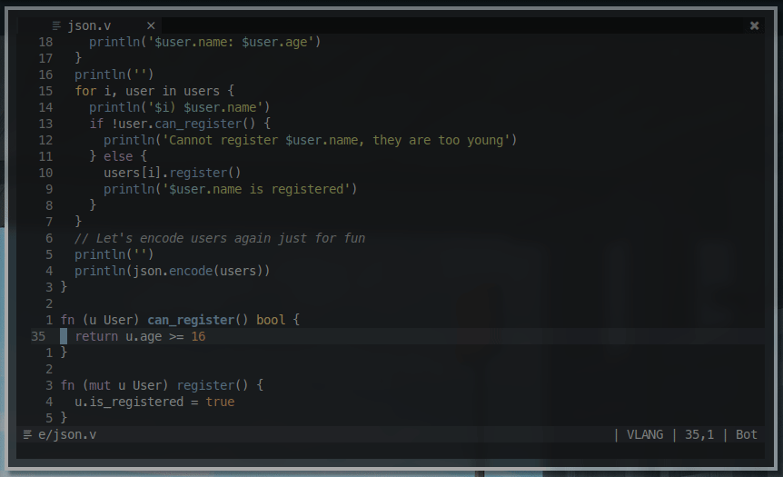
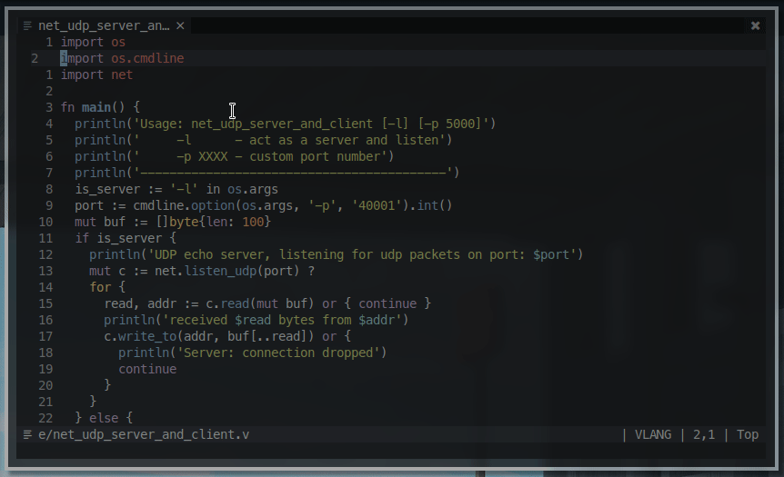
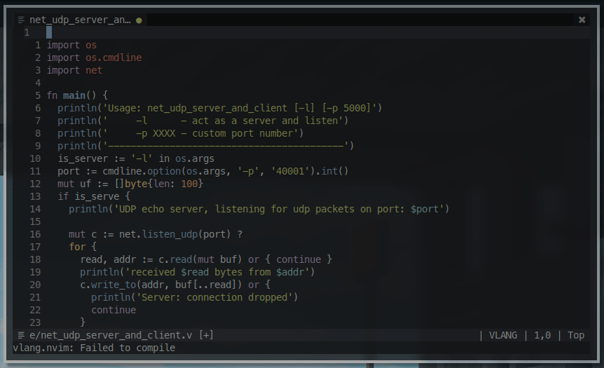

vlang.nvim
===================

Simple asynchronous and non blocking features and utilities for working with [Vlang](https://github.com/vlang/v).

#### Run current file


Run current file

TODO: support running the current directory, other files

#### Format on write


by default the plugin rans `v vet` before trying to run `v fmt`

#### Compile on write


Install
---------------------

```vim
Plug 'cheap-glitch/vim-v' " syntax highlighting
Plug 'nvim-lua/plenary.nvim'
Plug 'kkharji/vlang.nvim'
```

Options
--------------------

```vim
let g:vlang_nvim_autocmds = 1 " enable on write event
let g:vlang_nvim_check_on_write = 1 " vet
let g:vlang_nvim_format_on_write = 1 " fmt
let g:vlang_nvim_compile_on_write =  1 " compile
let g:vlang_nvim_mappings = 1 " use default mappings
let g:vlang_auto_open_quickfix = 1 " whether to auto open quick fix on errors

```

Commands
--------------------
- **Vvet**: look for suspicious code constructs in current file.
- **Vfmt**: format current file.
- **Vtest**: test current file or associated test file `TODO`.
- **Vrun**: run current file.


Mappings
-------------------
`let g:vlang_nvim_mappings = 0`
```vim
nmap <buffer> <silent> <leader>ef :lua require'vlang'.run_file()<CR>
nmap <buffer> <silent> <leader>ec :lua require'vlang'.prod(vim.fn.input("compile to: "))<CR>
nmap <buffer> <silent> <leader>ee :lua require'vlang'.run_file(vim.fn.input("args: "))<CR>
nmap <buffer> <silent> <leader>et :lua require'vlang'.test()<CR> " TODO
```

